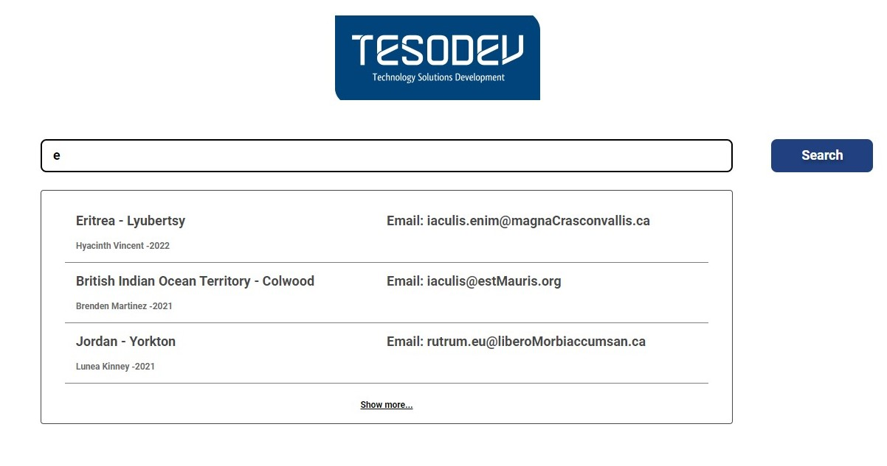
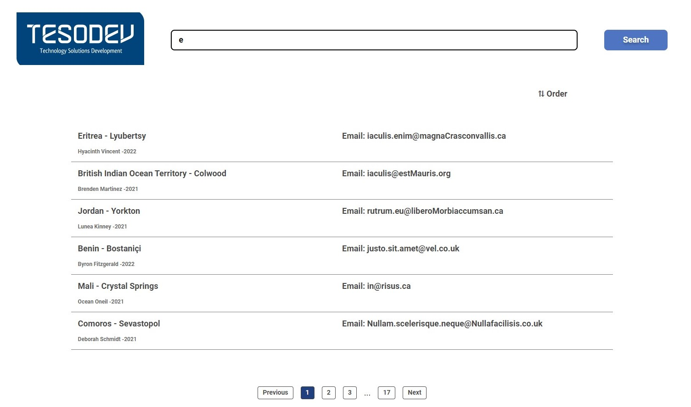

# Search Engine App
 

### :tada: <a href="https://search-engine-tesodev.netlify.app/">Live Project</a> :tada:

 

###  Requirement in this case?

  
:heavy_check_mark: User should start with landing(main) page.  
:heavy_check_mark: User searches a word and results should be searched in the “Name Surname” (or you can search on
more than one field) of the search data.  
:heavy_check_mark: Search should be done not only exact match, results with the search word in the field/s should be
displayed.  
:heavy_check_mark: After search the user should be see 3 (if exist) result under the Input field and if user click the load more,
redirected to the result page.  
:heavy_check_mark: In the result page there should be an ordering option which can order by name or date.  
:heavy_check_mark: A pagination should be present for the search results greater than 3.  
:heavy_check_mark: Writing tests is a bonus.  

 ## Home page
 
 

## Results page

 
